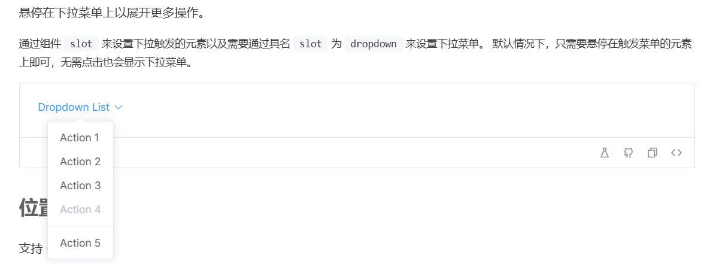

## Dropdown 下拉菜单



### 需求分析：

继承tooltip 组件 只需控制弹窗内容

### 开发计划：

1 渲染页面：

2 支持 h 自定义节点渲染：

3 修改单文件组件变成tsx组件

​	渲染 slots 

​		vue 使用：

​			默认：<slot/>

​			具名：<slot name="footer" />

​		jsx 使用：

​			默认：{ slots.default() }

​			具名：{ slots.footer() }

​	传递 slots

​		 vue:

​			<MyComponent> Hello </MyComponent>

- ```vue
  <MyComponent>
  	<template #footer> footer </template>
  </MyComponent>
  ```

  ​	  jsx:

  ​		<MyComponent> {() => 'hello'} </MyComponent>

  ​		<MyComponents> {{

  ​				default: () => 'default slot',

  ​				footer: () => <div> foooter </div>

  ​		}}

  ​		</MyComponent>

  ​	expose 

  ​		vue - defineExpose

  ​		jsx - expose

### 重难点：

##### 渲染函数 & JSX（h 函数语法糖）

虚拟DOM

虚拟 DOM (Virtual DOM，简称 VDOM) 是一种编程概念，意为将目标所需的 UI 通过数据结构“虚拟”地表示出来，保存在内存中，然后将真实的 DOM 与之保持同步。这个概念是由 [React](https://reactjs.org/) 率先开拓，随后被许多不同的框架采用，当然也包括 Vue。

> 挂载 -》 更新（比对， 协调） 

渲染管线

Vue组件 挂载时会发生下面几件事：

1.编译 2.挂载 3.更新

### 代码：

dropdonw.vue

```vue
<template>
  <div class="si-dropdown">
    <Tooltip
      :trigger="'click'"
      :popper-options="optionsTooltips"
      :open-delay="1000"
      :close-delay="1000"
      ref="tooltipRef"
      @visable-change="visibleChange"
    >
      <slot> </slot>
        <!-- 循环列表结构 -->
        <template v-slot:content>
          <ul class="si-dropdown_menu">

            <!-- template 可以生成空节点 -->
            <template v-for="item in props.menuOption" :key="item.key">

              <li
                v-if="item.divided"
                role="separator"
                class="divided-placeholder" ></li>
                <li
                class="si-dropdown__item"
                :class="{
                  'is-diabled': item.disabled,
                  'is-divided': item.divided
                }"
                @click="itemClick(item)"
                :id="`dropdown-item-${item.key}`"
              >
                <RenderVode :v-node="item.label"/>
              </li>
            </template>
          </ul>
        </template>
    </Tooltip>
  </div>
</template>
<script lang="ts" setup>
import type {
  DropdownProps,
  DropdownInstance,
  DropdownEmits,
  MenuOption,
} from "./types";
import Tooltip from "../Tooltip/Tooltip.vue";
import type { Options } from "@popperjs/core";
// RenderVnode 
import RenderVode  from "@/hooks/RenderVnode";
import type { TooltipInstance } from "@/components/Tooltip/type.ts";
import { ref, reactive} from "vue";
import type { Ref } from 'vue';

// tooltipRef 实例
// 第一种写法
// const tooltipRef = ref<TooltipInstance | null>(null);
// 第二种写法
const tooltipRef = ref() as Ref<TooltipInstance>;

// props
const props = withDefaults(defineProps<DropdownProps>(), {
  hideAfterClick: true
});
// emits
const emits = defineEmits<DropdownEmits>();
defineOptions({
  name: "dropdown",
});
const optionsTooltips: Partial<Options> = reactive({
  placement: "bottom",
  strategy: "fixed",
});
// 作为中间层传递作用
const visibleChange = (e: boolean) => {
  emits("visible-change", e);
};
const itemClick = (e: MenuOption) => {
  // 假如是否禁用
  if (e.disabled) {
    return;
  }
  emits("select", e);
  if (props.hideAfterClick){
    tooltipRef.value?.hide()
  }
};
defineExpose<DropdownInstance>({
  'show': tooltipRef.value?.show,
  'close': tooltipRef.value?.hide,
});
</script>

```

type.ts

```ts
import type { VNode } from "vue";
import type { TooltipProps } from "../Tooltip/type";

export interface MenuOption {
    // 难点
    label: string | VNode;
    key: string | number;
    disabled?: boolean;
    divided?: boolean; // 分隔符
 }

 export interface DropdownProps extends TooltipProps {
    menuOption: MenuOption[], // 弹出层各种选项
    hideAfterClick?: boolean
 }

// 事件
export interface DropdownEmits {
    // 是否展开
    (e: 'visible-change', value: boolean) : void;
    // 弹出层选项
    (e: 'select', value: MenuOption) : void;
}
// 实例
export interface DropdownInstance {
    show: () => void;
    close: () => void;
}
```

将单文件组件 替换 成tsx

```tsx
import { computed, defineComponent, Fragment } from "vue";
import { ref, type PropType } from "vue";
import type { Placement, Options } from "@popperjs/core";
import type { MenuOption } from "./types";
import Tooltip from "../Tooltip/Tooltip.vue";
import type { TooltipInstance } from "@/components/Tooltip/type.ts";

export default defineComponent({
  name: "SiDropdown", // 名称
  // 传值
  props: {
    placements: {
      // as PropType 更加准确定义类型
      type: String as PropType<Placement>,
      default: "bottom",
    },
    trigger: {
      type: String as PropType<"hover" | "click">,
      default: "click",
    },
    transisition: {
      type: String,
      default: "fade",
    },
    openDelay: {
      type: Number,
      default: 0,
    },
    closeDelay: {
      type: Number,
      default: 0,
    },
    popperOptions: {
      type: Object as PropType<Options>,
      required: true,
    },
    menuOptions: {
      type: Array as PropType<MenuOption[]>,
      required: true,
    },
    hideAfterClick: {
      type: Boolean,
      default: true,
    },
  },
  // 定义事件
  emits: ["visible-change", "select"],
  setup(props, { slots, emit, expose }) {
    const tooltipRef = ref<TooltipInstance | null>(null);

    const itemClick = (e: MenuOption) => {
      // 假如是否禁用
      if (e.disabled) {
        return;
      }
      emit("select", e);
      if (props.hideAfterClick) {
        tooltipRef.value?.hide();
      }
    };

    // 作为中间层传递作用
    const visibleChange = (e: boolean) => {
      emit("visible-change", e);
    };
    expose({
      show: () => tooltipRef.value?.show(),
      close: () => tooltipRef.value?.hide(),
    });
    const options = computed(() => {
      return props.menuOptions.map((item) => {
        return (
          <Fragment key={item.key}>
            {item.divided ? (
              <li role="separator" class="divided-placeholder"></li>
            ) : (
              ""
            )}
            <li
              // 动态展示样式
              class={{
                "si-dropdown__item": true,
                "is-diabled": item.disabled,
                "is-divided": item.divided,
              }}
              id={`dropdown-item-${item.key}`}
              onClick={() => itemClick(item)}
            >
              {item.label}
            </li>
          </Fragment>
        );
      });
    });
    return () => (
      <div class="si-dropdown">
        <Tooltip
          trigger={props.trigger}
          placements={props.placements}
          popperOptions={props.popperOptions}
          openDelay={props.openDelay}
          closeDelay={props.closeDelay}
          ref={tooltipRef}
          onVisibleChange={visibleChange}
        >
          {{
            default: () => slots.default && slots.default(),
            content: () => <ul class="si-dropdown_menu">{options.value}</ul>,
          }}
        </Tooltip>
      </div>
    );
  },
});
```

