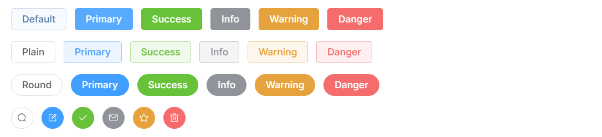

## Button

### 需求分析：

我们需要封装一个 Button 组件，支持多种样式和状态，包括不同类型的按钮（如默认、主要、成功、危险等）、不同大小、禁用状态、加载状态、圆角、圆形按钮等。通过封装，我们可以更方便地在项目中使用按钮，并且可以灵活地自定义按钮的样式和行为。

基本使用



### 主要写法：

1. 类型定义

```ts
type type = 'default' | 'primary' | 'success' | 'danger' | 'warning' | 'info';  // 按钮类型
type size = 'small' | 'large';  // 按钮大小
type NativeType = 'button' | 'submit' | 'reset';  // 原生 button 类型

export interface buttonProps {
  type?: type,  // 按钮类型
  size?: size,  // 按钮大小
  disabled?: boolean,  // 是否禁用
  plain?: boolean,  // 是否朴素按钮
  round?: boolean,  // 是否圆角按钮
  circle?: boolean,  // 是否圆形按钮
  nativeType?: NativeType,  // 原生 button 类型
  loading?: boolean,  // 是否加载中状态
  icon?: string,  // 图标类名
}
```

2. 主要代码

接下来是 Button 组件的 Vue 实现代码。我们使用 Vue 3 的 `<script setup>` 语法来简化代码，并通过 `withDefaults` 来设置默认值。

1. **模板部分**：
   - 使用 `<button>` 标签作为按钮的容器，并根据 `type` 和 `size` 动态添加样式类。
   - 通过 `:disabled` 属性控制按钮的禁用状态，如果 `disabled` 或 `loading` 为 `true`，按钮将被禁用。
   - 使用 `Icon` 组件来显示加载图标或自定义图标。
   - 使用 `<slot>` 来插入按钮的内容。
2. **脚本部分**：
   - 使用 `defineProps` 定义组件的 Props，并通过 `withDefaults` 设置默认值。
   - 使用 `ref` 创建一个引用，用于获取按钮元素的 DOM 引用。
   - 使用 `defineExpose` 将 `ref` 暴露给父组件，以便父组件可以直接访问按钮元素。
3. **样式部分**：
   - 可以在 `<style scoped>` 中编写样式，或者导入外部的样式文件。

```vue
<template>
  <button
    class="si-button"
    ref="_ref"
    :class="{
      [`si-button--${type}`]: true,  // 根据 type 动态添加样式类
      [`si-button--${size}`]: size,  // 根据 size 动态添加样式类
      'is-type': type,  // 如果 type 存在，添加 is-type 类
      'is-size': size,  // 如果 size 存在，添加 is-size 类
      'is-disabled': disabled,  // 如果 disabled 为 true，添加 is-disabled 类
      'is-round': round,  // 如果 round 为 true，添加 is-round 类
      'is-plain': plain,  // 如果 plain 为 true，添加 is-plain 类
      'is-loading': loading,  // 如果 loading 为 true，添加 is-loading 类
    }"
    :disabled="disabled || loading"  // 如果 disabled 或 loading 为 true，禁用按钮
    :type="nativeType"  // 设置 button 的原生类型
  >
    <!-- 如果 loading 为 true，显示加载图标 -->
    <Icon icon="fa-solid fa-spinner" v-if="loading" spin></Icon>
    <!-- 如果 icon 存在，显示图标 -->
    <Icon :icon="icon" v-if="icon"></Icon>
    <!-- 显示按钮内容 -->
    <span>
      <slot></slot>
    </span>
  </button>
</template>

<script setup lang="ts">
import type { buttonProps } from "./types.ts";  // 导入类型定义
import { ref } from "vue";  // 导入 ref 函数
import Icon from "../../components/Icon/Icon.vue";  // 导入 Icon 组件

// 定义组件的 Props，并设置默认值
withDefaults(defineProps<buttonProps>(), {
  nativeType: "button",  // 默认 button 类型为 'button'
  // disabled: true,  // 默认不禁用
  // loading: false,  // 默认不显示加载状态
});

// 定义组件名称
defineOptions({
  name: "SiButton",
});

// 定义 ref，用于获取 button 元素的引用
const _ref = ref<HTMLButtonElement>();

// 暴露 ref 给父组件
defineExpose({
  ref: _ref,
});
</script>

<style scoped>
/* 可以在这里添加样式，或者导入外部样式文件 */
/* @import "./style.css"; */
</style>
```

### 总结

通过这种方式，我们封装了一个灵活且易于使用的 Button 组件。它支持多种样式和状态，包括不同类型的按钮、不同大小、禁用状态、加载状态等。这种封装方式使得在项目中使用按钮变得更加简单和高效。