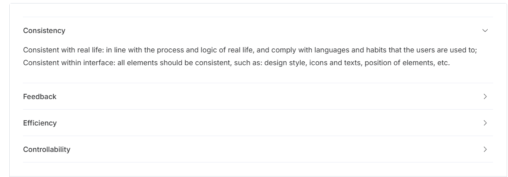

## Collapse 

### 需求分析：

我们需要封装一个 Collapse 组件，支持手风琴效果（即一次只能展开一个面板）和多个面板同时展开的功能。通过封装，我们可以更方便地在项目中使用折叠面板，并且可以灵活地自定义面板的标题和内容。



功能：标题/内容 | 手风琴

```vue
// 方案一 传入数组形式
<Collapse :item="item"></Collapse>
const items = [{
	name: 'a', // key
	title: 'title a',
	content: '文本 vnode h2'
}]
// 复杂 vnode 等样式展示问题
// 方案二 语义化展示
<Collapse>
    <CollapseItem title="Title A" name="1-1" >
         <p> Consistent with real life: in line with the process and logic of real</p>
    </CollapseItem>
</Collapse>
```

思路分析 

```js
// 维护一个可变化响应式数组，存在即是打开
ref(['a'])	
// 点击特定的item之后 进行添加或删除
['a'] | ['a', 'b'] | ['']
// 在组件内部，判断当前name是否存在数组中，进行是否打开
['a'].includes(props.title)
```

### 主要写法：

知识点：provide / inject | v-model | slots

#### 1 显示内容-html

types.ts 

```ts
type NameType = number | string;  // 面板的唯一标识类型

export interface CollapseItemProps {
    name: NameType;  // 面板的唯一标识
    title?: string;  // 面板标题
    content: string;  // 面板内容
}

export interface CollapseProps {
    modelValue: NameType[];  // 当前展开的面板
    accordion?: boolean;  // 是否开启手风琴模式
}
```

Collapse.vue

```vue
<script setup lang="ts">
    import CollapseProps from "./types"
     defineProps<CollapseProps>()
</script>

<template>
   <div class="si-collapse">
       <slot></slot>
    </div>
</template>

<style scoped>
 
</style>

```

CollapseItem.vue

```vue
<script setup lang="ts">
  import type { CollapseItemProps } from './types';
  const props = defineProps<CollapseItemProps>()
 
</script>

<template>
 <div
    class="si-collapse-item"
  >
    <div class="si-collapse-item__header" >
      <slot name="title" > {{ props.title }}</slot>
    </div>
    <div class="si-collapse-item__content">
        {{ props.content}}
    </div>
  </div>
</template>

<style scoped>
 
</style>
```

App.vue

```vue
 <Collapse>
        <CollapseItem name="a" title="Title a" content="dasd www  ddd"> </CollapseItem>
        <CollapseItem name="a"  content="dasd www  ddd">
          <template v-slot:title>
            <!-- header 插槽的内容放这里 -->
             <h2> Title B</h2>
          </template>
        </CollapseItem>

    </Collapse>
```

#### 2 事件

types.ts

```ts
export type NameType = number | string 
import type { InjectionKey, Ref} from 'vue'

export interface CollapseItemProps {
    name: NameType;  // 面板的唯一标识
    title?: string;  // 面板标题
    content: string;  // 面板内容
}

export interface CollapseProps {
    modelValue: NameType[];  // 当前展开的面板
    accordion?: boolean;  // 是否开启手风琴模式
}

export interface ContextCollapseKey {
    activeItems: Ref<NameType[]>;  // 当前展开的面板数组
    handlerHeaderClick: (name: NameType) => void;  // 处理面板点击事件
}

export const ContextCollapse = Symbol() as InjectionKey<ContextCollapseKey>;  // 提供/注入的上下文
```

collapse.vue

```vue
<script setup lang="ts">
    import { provide, ref} from "vue";
    import type { CollapseProps } from "./types"
    import type { NameType } from './types'
    import { ContextCollapse } from './types'
    const props = defineProps<CollapseProps>()
    // 外部传入进来的数组
    const activeItems  = ref<NameType[]>(props.items || [])
    // 子组件触发 
    const handlerHeaderClick = (name: NameType) => {

        // 非手风琴模式：可以展开多个面板
        const index = activeItems.value.indexOf(name);
        if (index !== -1) {
            activeItems.value.splice(index, 1);
        } else {
            activeItems.value.push(name);
        }
    }
    // 提供上下文给子组件
    provide(ContextCollapse, {
        activeItems,
        handlerHeaderClick
    })
</script>

<template>
   <div class="si-collapse">
       <slot></slot>
    </div>
</template>
```

collapseItem.vue

```vue
<script setup lang="ts">
  import type { CollapseItemProps } from './types';
  import { ContextCollapse } from './types'
  import { computed, inject } from 'vue';
  const props = defineProps<CollapseItemProps>()
  // 接受外部provide 传入的数据
  const CollapseIteminject = inject(ContextCollapse)
  // 处理面板标题点击事件
  const handlerHeader = () => {
    CollapseIteminject?.handlerHeaderClick(props.name);
  };

  // 判断当前面板是否展开
  const isActive = computed(() => {
    return CollapseIteminject?.activeItems.value.includes(props.name);
  });
</script>

<template>
 <div
    class="si-collapse-item"
  >
    <div class="si-collapse-item__header" @click="handlerHeader">
      <slot name="title" > {{ props.title }}</slot>
    </div>
    <div class="si-collapse-item__content" v-show="isActive">
        {{ props.content}}
    </div>
  </div>
</template>
```

3. 改为v-model 手风琴

types.ts


> modelValue 是固定写法


```ts
export type NameType = number | string 
import type { InjectionKey, Ref} from 'vue'

export interface CollapseItemProps {
    name: NameType;  // 面板的唯一标识
    title?: string;  // 面板标题
    content: string;  // 面板内容
}
export interface CollapseProps {
    modelValue: NameType[];  // 当前展开的面板
    accordion?: boolean;  // 是否开启手风琴模式
}
export interface ContextCollapseKey {
    activeItems: Ref<NameType[]>;  // 当前展开的面板数组
    handlerHeaderClick: (name: NameType) => void;  // 处理面板点击事件
}
// 定义collapse触发事件
export interface CollapseEmits {
    (e: 'update:modelValue', value: NameType[]): void
}
export const ContextCollapse =  Symbol() as InjectionKey<ContextCollapseKey> // 提供/注入的上下文
```

collapse.vue

```vue
<script setup lang="ts">
    import { provide, ref} from "vue";
    import type { CollapseProps } from "./types"
    import type { NameType, CollapseEmits} from './types'
    import { ContextCollapse } from './types'
    
    const props = defineProps<CollapseProps>()
    const emit = defineEmits<CollapseEmits>()

	// 当前展开的面板数组
    const activeItems = ref<NameType[]>(props.modelValue || []);
     // 处理面板点击事件
    const handlerHeaderClick = (name: NameType) => {
        if (props.accordion) {
            // 手风琴模式：一次只能展开一个面板
            if (activeItems.value[0] === name) {
                activeItems.value = [];
            } else {
                activeItems.value = [name];
            }
        } else {
            // 非手风琴模式：可以展开多个面板
            const index = activeItems.value.indexOf(name);
            if (index !== -1) {
                activeItems.value.splice(index, 1);
            } else {
                activeItems.value.push(name);
            }
        }

        // 触发 v-model 更新
        emit('update:modelValue', activeItems.value);
    };
     // 提供上下文给子组件
    provide(ContextCollapse, {
        activeItems,
        handlerHeaderClick
    });
</script>

<template>
   <div class="si-collapse">
       <slot></slot>
    </div>
</template>

```

collapseItem.vue

```vue
<script setup lang="ts">
  import type { CollapseItemProps } from './types';
  import { ContextCollapse } from './types'
  import { computed, inject } from 'vue';
  const props = defineProps<CollapseItemProps>()
  const CollapseIteminject = inject(ContextCollapse)
 // 处理面板标题点击事件
  const handlerHeader = () => {
    CollapseIteminject?.handlerHeaderClick(props.name);
  };

  // 判断当前面板是否展开
  const isActive = computed(() => {
    return CollapseIteminject?.activeItems.value.includes(props.name);
  });
</script>

<template>
 <div
    class="si-collapse-item"
  >
    <div class="si-collapse-item__header" @click="handlerHeader">
      <slot name="title" > {{ props.title }}</slot>
    </div>
    <div class="si-collapse-item__content" v-show="isActive">
        {{ props.content}}
    </div>
  </div>
</template>

<style scoped>

</style>
```

#### 3 样式

style.css

```css
.si-collapse {
    /* 定义 CSS 变量，用于控制 Collapse 组件的样式 */
    --si-collapse-border-color: var(--si-border-color-light); /* 边框颜色 */
    --si-collapse-header-height: 48px; /* 头部高度 */
    --si-collapse-header-bg-color: var(--si-fill-color-blank); /* 头部背景颜色 */
    --si-collapse-header-text-color: var(--si-text-color-primary); /* 头部文字颜色 */
    --si-collapse-header-font-size: 13px; /* 头部字体大小 */
    --si-collapse-content-bg-color: var(--si-fill-color-blank); /* 内容背景颜色 */
    --si-collapse-content-font-size: 13px; /* 内容字体大小 */
    --si-collapse-content-text-color: var(--si-text-color-primary); /* 内容文字颜色 */
    --si-collapse-disabled-text-color: var(--si-disabled-text-color); /* 禁用状态文字颜色 */
    --si-collapse-disabled-border-color: var(--si-border-color-lighter); /* 禁用状态边框颜色 */

    /* Collapse 组件的整体边框样式 */
    border-top: 1px solid var(--si-collapse-border-color);
    border-bottom: 1px solid var(--si-collapse-border-color);
}

.si-collapse-item__header {
    /* 头部样式 */
    display: flex; /* 使用 Flex 布局 */
    align-items: center; /* 垂直居中 */
    justify-content: space-between; /* 内容左右对齐 */
    height: var(--si-collapse-header-height); /* 头部高度 */
    line-height: var(--si-collapse-header-height); /* 行高与高度一致，确保文字垂直居中 */
    background-color: var(--si-collapse-header-bg-color); /* 头部背景颜色 */
    color: var(--si-collapse-header-text-color); /* 头部文字颜色 */
    cursor: pointer; /* 鼠标悬停时显示为手型，表示可点击 */
    font-size: var(--si-collapse-header-font-size); /* 头部字体大小 */
    font-weight: 500; /* 字体加粗 */
    transition: border-bottom-color var(--si-transition-duration); /* 边框颜色过渡效果 */
    outline: none; /* 去除点击时的默认外边框 */
    border-bottom: 1px solid var(--si-collapse-border-color); /* 底部边框 */

    /* 禁用状态下的头部样式 */
    &.is-disabled {
        color: var(--si-collapse-disabled-text-color); /* 禁用状态文字颜色 */
        cursor: not-allowed; /* 禁用状态鼠标样式 */
        background-image: none; /* 去除背景图片 */
    }

    /* 展开状态下的头部样式 */
    &.is-active {
        border-bottom-color: transparent; /* 展开时底部边框透明 */
        .header-angle {
            transform: rotate(90deg); /* 展开时箭头旋转 90 度 */
        }
    }

    /* 头部箭头的过渡效果 */
    .header-angle {
        transition: transform var(--si-transition-duration); /* 箭头旋转过渡效果 */
    }
}

.si-collapse-item__content {
    /* 内容区域样式 */
    will-change: height; /* 提示浏览器该元素的高度会发生变化，优化性能 */
    background-color: var(--si-collapse-content-bg-color); /* 内容背景颜色 */
    overflow: hidden; /* 内容溢出时隐藏 */
    box-sizing: border-box; /* 盒模型为 border-box，确保 padding 和 border 不会影响元素尺寸 */
    font-size: var(--si-collapse-content-font-size); /* 内容字体大小 */
    color: var(--si-collapse-content-text-color); /* 内容文字颜色 */
    border-bottom: 1px solid var(--si-collapse-border-color); /* 内容区域底部边框 */
    padding-bottom: 25px; /* 内容区域底部内边距 */
}

/* 折叠/展开动画效果 */
.slide-enter-active,
.slide-leave-active {
    transition: height 0.3s ease-in-out; /* 高度变化的过渡效果 */
}

.slide-enter-from,
.slide-leave-to {
    opacity: 0; /* 进入和离开时的透明度为 0 */
}

.slide-enter-to,
.slide-leave-from {
    opacity: 1; /* 进入和离开后的透明度为 1 */
}
```

